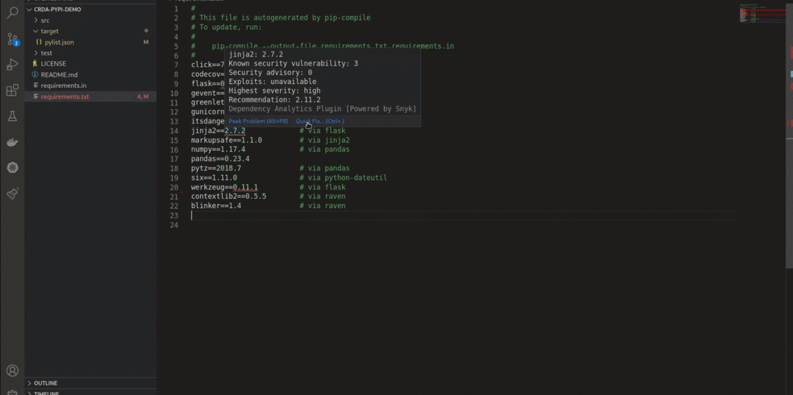
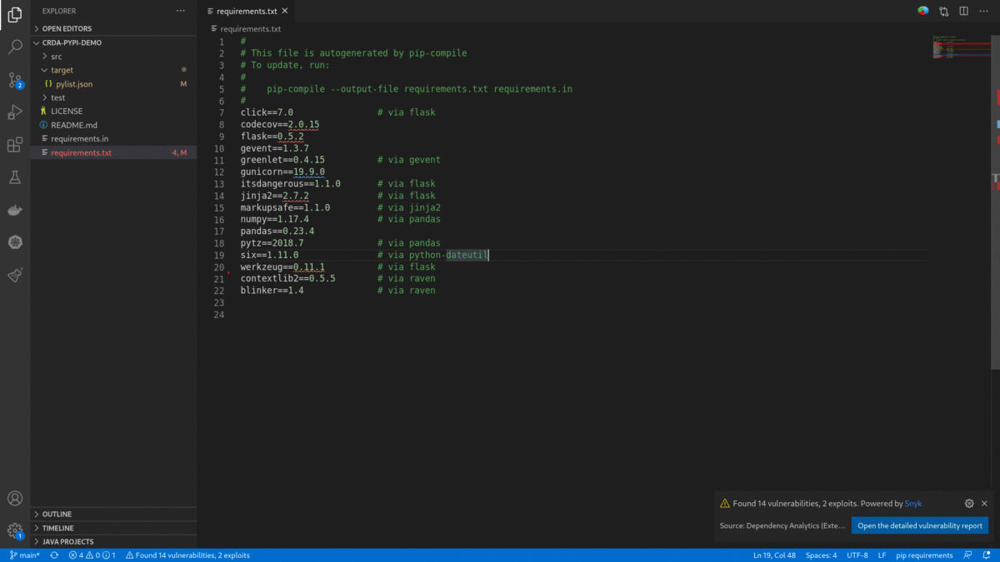
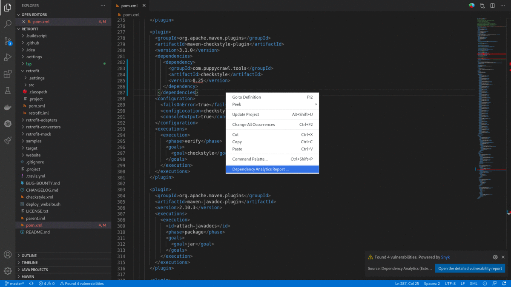
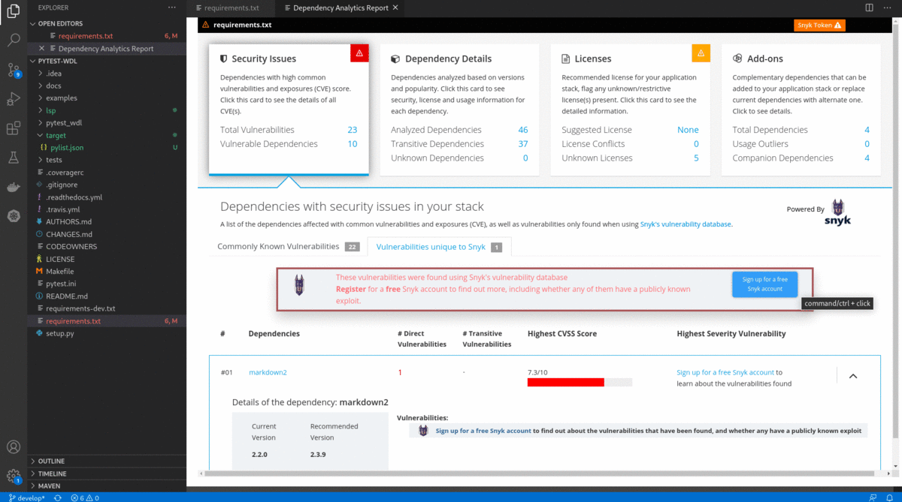
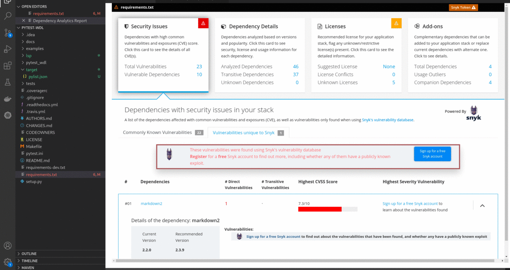
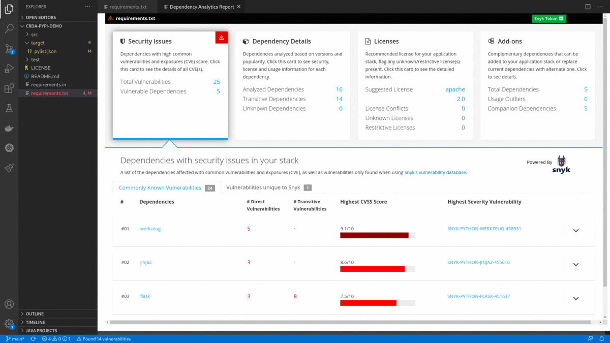

# Dependency Analytics

[](https://marketplace.visualstudio.com/items?itemName=redhat.fabric8-analytics)

[](https://codecov.io/gh/fabric8-analytics/fabric8-analytics-vscode-extension)

Dependency Analytics is powered by [Snyk Intel Vulnerability DB](https://snyk.io/product/vulnerability-database/), it is the most advanced and accurate open source vulnerability database in the industry. That adds value with the latest, fastest and more number of vulnerabilities derived from numerous sources.

'Dependency Analytics Report' with Insights about your application dependencies:

- Flags a security vulnerability(CVE) and suggests a remedial version
- Shows Github popularity metrics along with latest version
- Suggests a project level license, check for conflicts between dependency licences
- AI based guidance for additional, alternative dependencies

## Supported Languages

'Dependency Analytics' extension supports projects using Maven, projects build on npm (Node ecosystem), projects using Python and projects using Golang.
Extending support for other languages is currently under progress.

## Prerequisites

This extension assumes you have the following binaries on your `PATH`:

- `mvn` (for analyzing Java applications)
- `npm` (for analyzing Node applications)
- `python` (for analyzing Python applications)
- `go` (for analyzing Golang applications)

**Note:** By default, the `mvn/npm/go` command is executed directly in the terminal, which requires that `mvn/npm/go` is found in your system environment `PATH`. For Python applications [Interpreter Path](https://code.visualstudio.com/docs/python/environments#_manually-specify-an-interpreter) is required to be provided as below.
You can do this via preferences in VS Code:
File(Code on macOS) > Preferences > Settings to open your [Settings](https://code.visualstudio.com/docs/getstarted/settings) select Workspace (open settings.json) and add below.

```
{
    ...
    "maven.executable.path": "/path-to-maven-home/bin/mvn"
    "npm.executable.path": "/path-to-npm-home/bin/npm"
    "python.pythonPath": "/path-to-python-home/bin/python"
    "go.executable.path": "/path-to-go/bin/go"
    ...
}
```

> **NOTE** Dependency Analytics is an online service hosted and maintained by Red Hat. This open source software will access only your manifests and license file(s) to learn about application dependencies and licenses before giving you the report.

## Quick Start

- Install the extension.
- Opening or editing a manifest file (`pom.xml` / `package.json` / `requirements.txt` / `go.mod`) scans your application for security vulnerabilities.
- Right click on a manifest file (`pom.xml`/`package.json` / `requirements.txt` / `go.mod`) in the 'Vscode File explorer' or 'Vscode File editor' to display 'Dependency Analytics Report' for your application.

## Features

1. Opening or editing a manifest file (`pom.xml` / `package.json` / `requirements.txt` / `go.mod`) scans your application for security vulnerabilities, flag them along with 'Quick Fix'.


2. 'Quick Fix' provides single click option to `Switch to the recommended version` for vulnerability remediation, it also provides option for `Detailed Vulnerability Report` to display 'Dependency Analytics' report with detailed vulnerabilty analysis.



3. Right click on a manifest file(`pom.xml` / `package.json` / `requirements.txt`) and choose 'Dependency Analytics Report ...' OR click on  icon in editor group OR click on status bar message to display 'Dependency Analytics' report as shown below. This report covers deeper insights into your application dependencies:

- Flags a security vulnerability(CVE) and suggests a remedial version
- Shows Github popularity metrics along with latest version
- Suggests a project level license, check for conflicts between dependency licences
- AI based guidance for additional,alternative dependencies



4. **For multi module maven application** Right click on root `pom.xml` in editor window and choose 'Dependency Analytics Report ...' to display 'Dependency Analytics' report for the entire application.



---

**Note** It creates a folder `target` in workspace which is used for processing of manifest files, needed for generating stack report. So kindly add `target` in `.gitignore`.

## Register for a free Snyk Account and Connect Snyk to your Red Hat Dependency Analytics

1. Clicking on the `Sign up for a free Snyk account` from 'Dependency Analytics report' will take you to the Snyk sign up page for a free Snyk account. After signing up for a free Snyk account it goes to the 'Snyk's Landing page' which shows `Snyk token` to connect Snyk with your Red Hat Dependency Analytics. Copy and paste the Snyk token into Red Hat Dependency Analytics Report as shown below.



2. Look for  in Dependency Analytics Report and click on the button to enter your Snyk Token. Paste your snyk token and click on the `Submit button`.



3. After successfully entering the Snyk token the Dependency Analyitcs report will be updated with detailed information about security vulnerabilities unique to Snyk and vulnerabilities having publicly known exploits.



# Know more about Dependency Analytics Platform

The mission of this project is to significantly enhance developer experience:
providing Insights(security, licenses, AI based guidance) for applications and helping developers, Enterprises.

- [GitHub Organization](https://github.com/fabric8-analytics)

# Common Errors and FAQ

1. VScode output says "Go executable not found".

    **Suggestion:** Try adding your go executable path to your vscode's settings.json file

    **E.g.:** `"go.executable.path": "/path-to-go/bin/go"`

2. Failed to run golist command.

    **Suggestion:** Resolve the error thrown by `go mod tidy` and `go list` for the project and try again. 

3. Stack analysis fails after applying the recommended version.

    **Suggestion:** Not all recommended versions work directly, developers need to resolve dependencies for the recommended version using `go mod tidy` or manually.

4. Plugin does not highlight vulnerabilities in vendor code.

    **Suggestion:** Currently plugin does not support vendor (or local) code vulnerabilities scanning. Switch to go.mod to express your project dependencies.

# Feedback & Questions

- File a bug in [GitHub Issues](https://github.com/fabric8-analytics/fabric8-analytics-vscode-extension/issues)

# License

Apache 2.0, See [LICENSE](LICENSE) for more information.

# Data and telemetry

The Red Hat Dependency Analytics Extension for Visual Studio Code collects anonymous [usage data](Telemetry.md) and sends it to Red Hat servers to help improve our products and services. Read our [privacy statement](https://developers.redhat.com/article/tool-data-collection) to learn more. This extension respects the `redhat.elemetry.enabled` setting which you can learn more about at https://github.com/redhat-developer/vscode-commons#how-to-disable-telemetry-reporting

---

**Disclaimer** : Dependency Analytics does not analyse dev/test dependencies associated with the Stack.